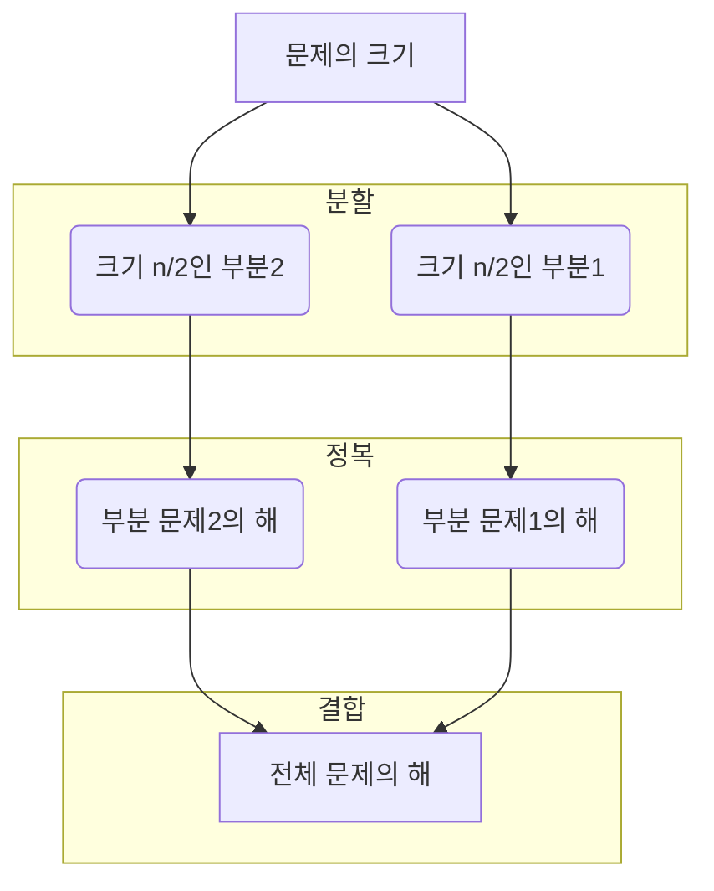

## 목차

## 분할 정복

큰 문제를 작은 하위 문제로 나누어 해결하는 방식

- 설계 전략
    - 분할
    - 정복
    - 결합

### Top-down 접근

### 거듭제곱

$
C^n = 
\begin{cases}
C^\frac{n}{2} \times C^\frac{n}{2}\ \ (n은\ 짝수)\\ 
C^\frac{n-1}{2} \times C^\frac{n-1}{2} \times C \ (n은\ 홀수)
\end{cases}
$

### 이진 검색

정렬된 배열에서 특정한 값을 빠르게 찾기 위한 알고리즘

- 검색과정
    1. 중앙 값 찾기
    2. 목표 값과 중아 값 비교
        1. 목표 값과 중앙 값이 같은 경우: 검색 종료
        2. 목표 값이 중앙 값 보다 작을 경우: 왼쪽 절반 검색 수행
        3. 목표 값이 중앙 값 보다 클 경우: 오른쪽 절반 검색 수행
    3. 탐색 범위가 한 개의 원소가 될 때 까지 반복 수행

#### 이진 검색 정리

- 시간 복잡도 `O(log N)`  
- 미리 정렬 되어있어야 함  
- 크기가 작은 배열에서 크게 이점이 없을 수 있음  
- 심화
    - `java.util.Arrays.binarySearch`
    - BST(Binary Search Tree)
    - 응용 -> `Lower Bound`, `Upper Bound`

### 병합 정렬

- 분할 정복 기법을 활용한 **안정적인** 정렬 알고리즘
- 배열을 절반으로 분할하고, 각 부분을 재귀적으로 정렬한 뒤, 정렬된 부분 배열을 다시 병합하는 정렬 방식
- 시간 복잡도 `O(N log N)`
- 추가 메모리 공간 필요

### 퀵 정렬

- 분할 정복 기법을 활용한 **효율적인** 정렬 알고리즘
- 피벗이라는 기준 요소를 선택하여 배열을 두 부분으로 분할하고, 재귀적으로 정렬하는 방식
- 시간 복잡도 `O(N log N)`, 최악의 경우 `O( N²)`